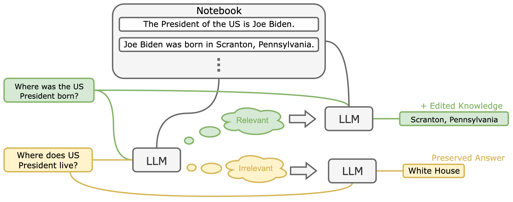
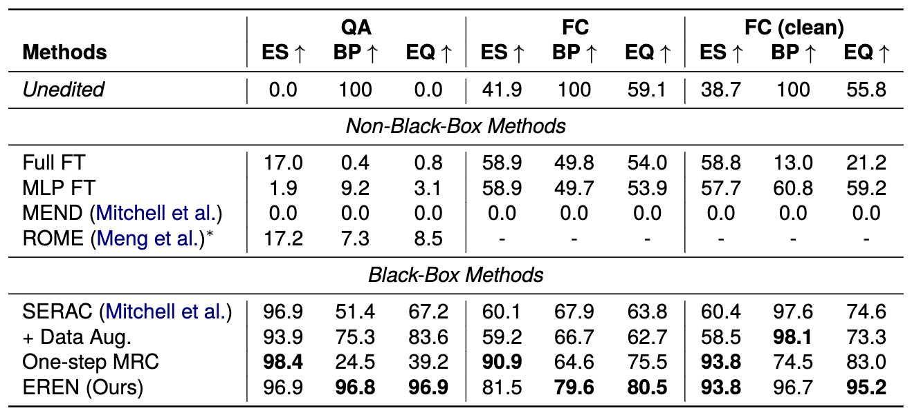

# EREN: Robust and Scalable Model Editing for Large Language Models

This repo is the official implementation for the COLING 2024 paper [Robust and Scalable Model Editing for Large Language Models (upcoming)](https://arxiv.org/abs/2403.17431v1). 

## Table of Contents

- [Introduction](#introduction)
- [Result](#result)
- [Datasets](#datasets)
- [How to Run](#how-to-run)
- [Citation](#citation)

## Introduction

Our paper presents a model editor called EREN (Edit models by REading Notes).

- **State-of-the-art LLM editor:** Our model editor utilizes proper prompting methods to render instruction-finetuned LLMs highly controllable by contextual knowledge and robust to irrelevant context, thereby achieve state-of-the-art model editing in QA and fact-checking.
- **Aggregating Multiple Edits:** Empirical results show that our method can correct answer queries that depend on knowledge from multiple edits -- a feature that most existing editors cannot handle.
- **Cleaner and more challenging dataset:** To better evaluate the robustness of model editors, we clean up existing datasets for model editing (CounterFact and FEVER). We also construct a new, more challenging dataset -- **CounterFact-Hard** -- that contains irrelevant questions that are more challenging than existing ones in QA. 



> The framework of our method, EREN.

## Result

Our LLM editor significantly outperforms existing methods. In the Figure below, QA and FC refers to our versions of CounterFact-Hard (question-answering dataset) and FEVER (fact-checking dataset).

Metrics:

- **ES** (Edit Success): the percentage of examples where the model correctly answers the question after the edit.
- **BP** (Behavior Preservation): the percentage of unrelated examples whose output were not changed by the edit.
- **EQ** (Edit Quality): the harmonic mean of ES and BP.



> Comparison between our method and state-of-the-art model editors on question-answering (QA) and fact-checking (FC).

## Datasets

Our cleaner versions of CounterFact and FEVER are included in this repo in JSON format.

| Dataset          | Task Type                  | Path                             | Number of edits |
| ---------------- | -------------------------- | -------------------------------- | --------------- |
| CounterFact-Hard | QA based on single edits   | `data/cfh_filtered.json`         | 1,024           |
| FEVER            | Fact-Checking              | `data/fever_filtered.json`       | 1,024           |
| FEVER-Clean      | Fact-Checking              | `data/fever_filtered_small.json` | 128             |
| HotpotQA         | QA based on multiple edits | `data/hotpot.json`               | 1,024           |

> Note that for FEVER, there will be 2048 and 256 examples, because the first half are used as edits and the second half is used as out-of-scope examples to test behavior preservation on unrelated inputs.

## How to Run?

> Execute the following commands inside the `src` directory.

### Installation:

```shell
pip install -r requirements.txt
```

### Evaluation

Our method does not require training and only utilizes pre-trained LLMs, so you just run the following to evaluate our method on one of the tasks (by default it tests on CounterFact-Hard):

```shell
python test_eren.py
```

Results will be dumped to `result` by default, and you can specify the output directory by `--output_dir`.

Some important arguments:

- `--data_path`: The path of the JSON file containing the data, one of `data/cfh_filtered.json`, `data/fever_filtered.json`, `data/fever_filtered_small.json`, `data/hotpot.json`. Default: `data/cfh_filtered.json`.
- `--one_step_mrc`: If not 0, the code will run the one-step MRC (baseline in the paper) instead. Default: 0.
- `num_context_examples`: The number of edits to retrieve during inference.
- `pretrained_name`: The pretrained path of the pre-trained model. Default: `google/flan-t5-xl`.
- `--device`: 'cuda' or 'cpu', specifies the device to run the code.

Run `python test_eren.py -h` for more options.

### Evaluation of Baselines

I have also included the code for evaluating SERAC, unedited model, and fine-tuning, which are baselines in the paper. The latter two should work directly, but for SERAC, you need to train a checkpoint using the [official code of SERAC](https://github.com/eric-mitchell/serac) (because the authors of SERAC does not release the trained checkpoints), and my evaluation code should load them appropriately. For the ROME and MEND baselines, please refer to their official repository (or some other re-implmentations).

## Contact Me

Feel free to contact me by email (`chenyingfa1999 (at) qq (dot) com`) if you have any questions or discussions. You can also raise questions in the issue section.

## Citation

If you find this repo useful, please cite our paper:

```bibtex
@inproceedings{chen2024eren,
  title={Robust and Scalable Model Editing for Large Language Models},
  author={Chen, Yingfa and Zhang, Zhengyan and Han, Xu and Xiao, Chaojun and Liu, Zhiyuan and Chen, Chen and Li, Kuai and Yang, Tao and Sun, Maosong},
  booktitle={Proceedings of the 2024 Joint International Conference on Computational Linguistics, Language Resources and Evaluation},
  url={https://arxiv.org/abs/2403.17431v1},
  year={2024}
}
```
